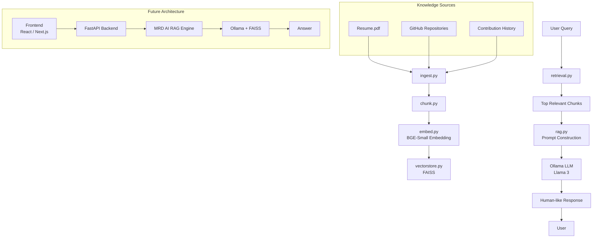

#  MRD AI Architecture

```mermaid
flowchart TD

    subgraph Knowledge Sources
        A[Resume.pdf]
        B[GitHub Repositories]
        C[Contribution History]
    end

    A --> D[ingest.py]
    B --> D
    C --> D

    D --> E[chunk.py]
    E --> F[embed.py<br/>BGE-Small Embedding]
    F --> G[vectorstore.py<br/>FAISS]

    H[User Query] --> I[retrieval.py]
    I --> J[Top Relevant Chunks]
    J --> K[rag.py<br/>Prompt Construction]
    K --> L[Ollama LLM<br/>Llama 3]
    L --> M[Human-like Response]
    M --> N[User]

    subgraph Future Architecture
        O[Frontend<br/>React / Next.js]
        O --> P[FastAPI Backend]
        P --> Q[MRD AI RAG Engine]
        Q --> R[Ollama + FAISS]
        R --> S[Answer]
    end
```