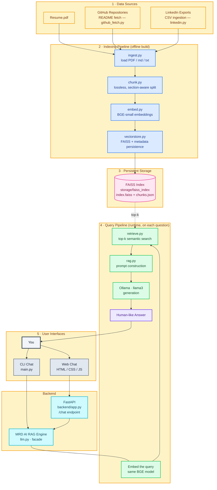

# MRD AI Architecture

Everything runs **locally and free**: BGE embeddings for vectors, FAISS for storage/retrieval, and Ollama (Llama 3) for generation. No paid APIs.

## Pipeline walkthrough

| Stage | Script | What it does |
|---|---|---|
| **1. Data Sources** | `github_fetch.py`, `linkedin.py` | Collects the raw material: the resume PDF, the canonical README of every GitHub repo (byte-exact, via the GitHub REST API), and LinkedIn CSV exports (deduplicated). |
| **2. Indexing** | `ingest.py` → `chunk.py` → `embed.py` → `vectorstore.py` | Loads every source, splits it into **lossless** section-aware chunks (code blocks, tables and lists stay intact), embeds each chunk with **BGE-small**, and writes the vectors plus metadata to disk. |
| **3. Storage** | — | FAISS `IndexFlatIP` with `chunks.json` (original text + section + repo + provenance metadata). Rebuild with `python main.py`. |
| **4. Query** | `retrieve.py` → `rag.py` → Ollama | The user's question is embedded with the *same* BGE model, the **top-k** most similar chunks are retrieved from FAISS, assembled into a grounded prompt, and handed to **Llama 3** in Ollama. |
| **5. Interfaces** | `main.py`, `backend/app.py`, `frontend/` | Both the interactive CLI and the web chat route through the `llm.py` facade; the web path adds a FastAPI `/chat` API in front of it. The answer flows back to you. |