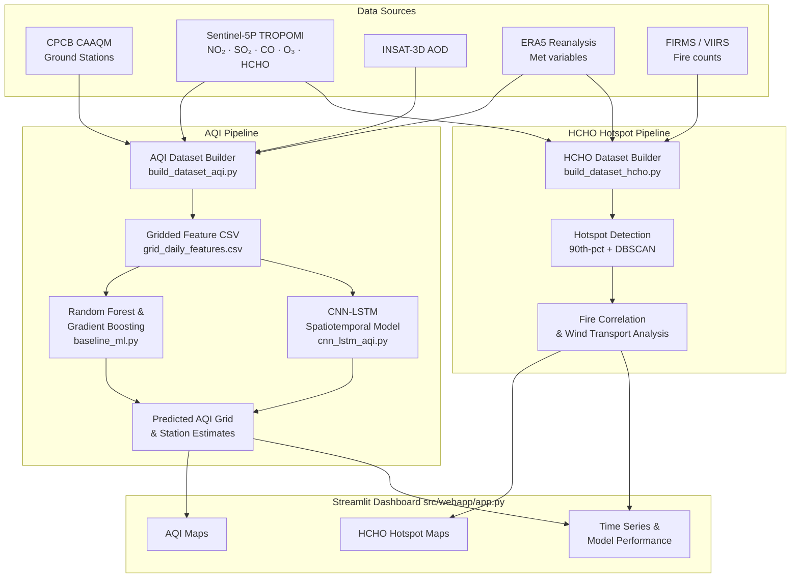

# ISRO Hackathon — Surface AQI & HCHO Hotspot Detection over India

**Problem Statement (ISRO SIH 2024):**
*"Development of Surface AQI & Identification of HCHO Hotspots over India using Satellite Data"*

---

## What's New in V3

| Area | Change |
|------|--------|
| **Feature Engineering** | Rolling means (3-day, 7-day per cell) · month/weekday sin-cos · 3×3 spatial context |
| **Models** | `ConvLSTMCell` / `ConvLSTMModel` · `build_model(config)` factory |
| **HCHO Pipeline** | Daily HCHO anomaly · hotspot persistence · GeoJSON cluster export · top-N regions CSV |
| **Config** | `paths.yaml` extended with multi-year, dev_mode, storage_format, extra_features |
| **CLI** | `scripts/run_pipeline.py` — single entry-point for all pipeline stages |
| **Config utils** | `src/utils/config_utils.py` — YAML validation, nested-key access, default merging |
| **Static layers** | `src/data/download_static_layers.py` — land cover, population, elevation stubs |
| **Dashboard** | Help boxes on every page · unit labels · download buttons · FEATURE_META dict |
| **Models README** | `models/README.md` — naming convention, loading instructions, reproduceability |

---

## Overview

This repository implements a two-objective ML/GIS pipeline that fuses multi-source
satellite observations, reanalysis data, and CPCB ground measurements to:

1. **Predict and map surface AQI** over India without relying on dense ground-station
   coverage — using TROPOMI satellite columns, INSAT-3D AOD, and ERA5 reanalysis as
   predictors with Random Forest, Gradient Boosting, and CNN-LSTM models.

2. **Detect HCHO hotspots linked to biomass burning** — identifying seasonal patterns
   of elevated formaldehyde from TROPOMI HCHO, correlating with FIRMS fire counts,
   and mapping wind-driven transport over India.

A **7-page Streamlit dashboard** integrates all outputs for interactive exploration.

---

## Objectives

| # | Objective | Approach |
|---|-----------|----------|
| 1 | Predict surface AQI (PM2.5, overall AQI) | Satellite + met features → RF / GBM / CNN-LSTM → gridded AQI maps |
| 2 | Detect HCHO hotspots from biomass burning | TROPOMI HCHO + FIRMS fire → 90th-pct flagging + DBSCAN clustering + wind transport |

---

## Architecture Diagram



---

## Alignment with ISRO Problem Statement (V4)

This repository now includes explicit outputs and UX elements that map to the ISRO Hackathon requirements:

| ISRO Requirement | This project (V4) |
|---|---|
| India-wide surface AQI maps at regular lat–lon cells | Regular 0.1° grid defined in `src/data/grid_definition.py`; full-grid predictions exported as NetCDF (`data/processed/predicted_aqi_grids/predicted_pm25.nc`) via `src/models/export_predictions_grid.py`. |
| Predict surface PM2.5 / AQI using satellite + AOD + met | Features joined in `src/data/build_dataset_aqi.py` and models in `src/models/cnn_lstm_aqi.py` / `src/models/train_aqi.py`. |
| Identify HCHO hotspots and link to fires | HCHO ingestion + hotspot features in `src/features/make_features_hcho.py`; dashboard page `HCHO Hotspots` visualises hotspots, fire counts and wind transport. |
| Dashboard shows continuous maps, hotspots, and transport | Streamlit app (`src/webapp/app.py`) renders gridded AQI maps, a coarse GeoJSON choropleth for fast rendering, HCHO cluster tables, quiver transport overlays and correlation plots. |

See `docs/isro_compliance.md` for the technical checklist and data products.


## Data Sources

| Source | Variables | Access |
|--------|-----------|--------|
| [CPCB CAAQM](https://airquality.cpcb.gov.in) | PM2.5, PM10, NO₂, SO₂, O₃, CO | Public portal; `download_cpcb.py` |
| [Sentinel-5P TROPOMI](https://developers.google.com/earth-engine/datasets/catalog/sentinel-5p) | NO₂, SO₂, CO, O₃, HCHO columns | Google Earth Engine / DLR |
| [INSAT-3D AOD](https://www.mosdac.gov.in) | Aerosol optical depth 550 nm | MOSDAC login required |
| [ERA5 Reanalysis](https://cds.climate.copernicus.eu) | T2m, RH2m, u10, v10, TP, SP, BLH | CDS API key required |
| [NASA FIRMS](https://firms.modaps.eosdis.nasa.gov) | MODIS/VIIRS fire pixel counts | MAP_KEY required |
---

## Repository Structure

```
isro-aqi-hcho/
├── README.md
├── requirements.txt
├── env_example.yml
├── config/
│   ├── paths.yaml              # Data directory paths and grid bbox
│   ├── aqi_training.yaml       # Model architecture and training config (V2)
│   └── hcho_hotspot.yaml       # Hotspot detection parameters
├── data/
│   ├── README.md               # Dataset schemas and download recipe
│   ├── raw/                    # Downloaded source data (gitignored)
│   ├── interim/                # Grid-aligned intermediates
│   └── processed/              # Final model-ready datasets
├── notebooks/
│   ├── 01_explore_cpcb.ipynb                  # CPCB data exploration
│   ├── 02_explore_satellite_reanalysis.ipynb  # Satellite feature analysis
│   ├── 03_train_baseline_and_cnn_lstm.ipynb   # Model training & evaluation
│   └── 04_hcho_hotspots_and_fire.ipynb        # HCHO hotspot analysis
├── src/
│   ├── data/
│   │   ├── grid_definition.py          # 0.1° India grid
│   │   ├── download_cpcb.py
│   │   ├── download_tropomi.py
│   │   ├── download_insat_aod.py
│   │   ├── download_reanalysis.py
│   │   ├── download_firms_fire.py
│   │   ├── download_static_layers.py   # [V3] Land cover, population, elevation stubs
│   │   ├── build_dataset_aqi.py        # AQI dataset builder (--synthetic flag)
│   │   └── build_dataset_hcho.py       # HCHO dataset builder (--synthetic flag)
│   ├── features/
│   │   ├── make_features_aqi.py        # [V3] + rolling means, temporal, spatial context
│   │   ├── make_features_hcho.py       # [V3] + HCHO anomaly, persistence, GeoJSON
│   │   └── add_static_features.py      # [V3] Merge static layers into feature matrix
│   ├── models/
│   │   ├── baseline_ml.py              # RF & GBM with GridSearchCV (V2)
│   │   ├── cnn_lstm_aqi.py             # [V3] + ConvLSTMCell/Model + build_model()
│   │   ├── train_aqi.py                # Training loop + hparam sweep (V2)
│   │   └── evaluate_aqi.py             # Evaluation & plot generation
│   ├── utils/
│   │   ├── aqi_calculator.py           # Official CPCB Indian AQI formula
│   │   ├── config_utils.py             # [V3] YAML validation, nested-key helpers
│   │   └── logging_utils.py            # Centralised logging setup (V2)
│   ├── visualization/
│   │   ├── plot_maps.py
│   │   ├── plot_time_series.py
│   │   └── plot_hotspots.py
│   └── webapp/
│       └── app.py                      # [V3] Streamlit dashboard (7 pages + help/download)
├── models/
│   ├── README.md                       # [V3] Model naming, loading, reproduceability
│   ├── baseline/                       # Trained RF/GBM .joblib files
│   └── cnn_lstm/                       # best_model.pt checkpoints
├── scripts/
│   ├── run_pipeline.py                 # [V3] Top-level CLI for all pipeline stages
│   ├── run_train_aqi.sh
│   └── run_hcho_hotspots.sh
└── logs/                               # Training log files (gitignored)
```

---

## Installation

Follow these steps if you have just cloned the repository and want to run it locally from scratch.

### Option A — Standard Python Virtual Environment (Recommended)

**1. Navigate to the core project directory:**
```bash
cd isro-aqi-hcho
```

**2. Create a virtual environment:**
```bash
# Windows
python -m venv venv

# macOS / Linux
python3 -m venv venv
```

**3. Activate the virtual environment:**
```bash
# Windows
.\venv\Scripts\activate

# macOS / Linux
source venv/bin/activate
```

**4. Install dependencies:**
```bash
pip install -r requirements.txt
```

### Option B — conda
```bash
cd isro-aqi-hcho
conda env create -f env_example.yml
conda activate isro-aqi-hcho
```

### Option C — uv (Fastest)
```bash
# If you have uv installed (from the root directory):
uv sync
```

### API credentials
See `data/README.md` for setting up CDS, GEE, MOSDAC, and FIRMS keys.

---

## Step-by-Step Usage

### 0 — Start the dashboard immediately (no data needed)
```bash
cd isro-aqi-hcho
streamlit run src/webapp/app.py
```
The dashboard auto-generates synthetic demo data on first launch.

---

## V3 Quick-Start (5 commands)

All pipeline stages are now accessible via a single CLI entry-point:

```bash
cd isro-aqi-hcho

# Full demo pipeline (no API keys needed)
python scripts/run_pipeline.py run_all --synthetic

# Or run stages individually:
python scripts/run_pipeline.py build_datasets   --synthetic   # generate data
python scripts/run_pipeline.py train_baseline                 # RF + GBM
python scripts/run_pipeline.py train_deep       --synthetic   # CNN-LSTM
python scripts/run_pipeline.py export_for_dashboard           # feature CSVs
```

See `python scripts/run_pipeline.py --help` (or `<command> --help`) for all options.

---

### 1 — Generate synthetic demo data for notebooks & training
```bash
cd isro-aqi-hcho
# V3 single command:
python scripts/run_pipeline.py build_datasets --synthetic

# Or the original module calls:
python -m src.data.build_dataset_aqi --synthetic
python -m src.data.build_dataset_hcho --synthetic
```

### 2 — (Optional) Download real data
```bash
python scripts/run_pipeline.py download_all \
   --start YYYY-MM-DD --end YYYY-MM-DD

# Or individually:
python -m src.data.download_cpcb   --start_date YYYY-MM-DD --end_date YYYY-MM-DD
python -m src.data.download_tropomi --start_date YYYY-MM-DD --end_date YYYY-MM-DD
python -m src.data.download_reanalysis --start_date YYYY-MM-DD --end_date YYYY-MM-DD
python -m src.data.download_firms_fire --start_date YYYY-MM-DD --end_date YYYY-MM-DD
python -m src.data.build_dataset_aqi    # without --synthetic uses real downloads
python -m src.data.build_dataset_hcho
```

### 3 — Train baseline models
```bash
python scripts/run_pipeline.py train_baseline

# Or the original call:
python -m src.models.baseline_ml \
    --input data/processed/aqi_training_dataset.csv \
    --output_dir models/baseline

# With hyperparameter search:
python -m src.models.baseline_ml --hparam_search
```

### 4 — Train CNN-LSTM or ConvLSTM
```bash
# CNN-LSTM (default, config/aqi_training.yaml)
python scripts/run_pipeline.py train_deep --synthetic

# ConvLSTM — set model_type: convlstm in config/aqi_training.yaml then:
python -m src.models.train_aqi --config config/aqi_training.yaml

# Hyperparameter sweep
python -m src.models.train_aqi --hparam_sweep
```

### 5 — Run Jupyter notebooks
```bash
jupyter lab notebooks/
```
All notebooks work with synthetic data out of the box.

---

## Model Details

### Baseline Models
| Model | Library | Key params |
|-------|---------|------------|
| Random Forest | scikit-learn | 200 trees, max_depth=15, temporal split |
| Gradient Boosting | scikit-learn | 200 trees, depth=6, lr=0.05 |

- Features: 13 satellite + met variables (TROPOMI, INSAT AOD, ERA5)
- Train split: 2019–2021 · Test split: 2022
- Saved as `.joblib` files; metrics logged to `baseline_results.csv`

### CNN-LSTM (V2)
| Component | Architecture |
|-----------|-------------|
| Input | `(B, T=7, C=13, H=30, W=30)` |
| SpatialEncoder | 2× Conv2D + BN + ReLU (32→64 filters) |
| LSTM | 2-layer, 128 hidden units |
| FC Head | 64 → H×W flat output |
| Output | `(B, H, W)` — predicted PM2.5 grid |

### ConvLSTM (V3)
| Component | Architecture |
|-----------|-------------|
| Input | `(B, T=7, C=13, H=30, W=30)` |
| ConvLSTM | 2 layers: 64→128 hidden channels, kernel 3×3 |
| Refinement | Conv2D 128→64 + Dropout2d |
| Prediction | Conv2D 64→1 (1×1 kernel) |
| Output | `(B, H, W)` — predicted PM2.5 grid |

Use `build_model(config)` to instantiate either model:
```python
config["model"]["model_type"] = "cnnlstm"   # or "convlstm"
model = build_model(config)
```

- Training: Adam + ReduceLROnPlateau, early stopping (patience=10)
- Automatic GPU acceleration (CUDA if available)

---

## HCHO Hotspot Methodology

1. **Aggregation** — daily TROPOMI HCHO columns are snapped to the 0.1° grid
2. **Percentile flagging** — cells above the 90th seasonal percentile are marked
3. **Clustering** — DBSCAN (ε=1.5 grid cells, min_samples=4) merges contiguous
   hotspot cells into labelled regions
4. **Fire correlation** — Pearson-r between HCHO and FIRMS fire counts at lags
   0–3 days; post-monsoon (Oct–Nov) consistently shows the highest correlations
   in Punjab-Haryana and northeast India crop-residue burning zones
5. **Wind transport** — ERA5 u10/v10 quivers are overlaid on hotspot maps to
   illustrate downwind transport of biomass burning emissions

---

## Debugging the Dashboard

**Dashboard shows blank / spinning:**
1. Check the workflow is running: `artifacts/isro-dashboard: web` should show "RUNNING".
2. Confirm Streamlit config is correct: `.streamlit/config.toml` must have
   `port = 25295` and `address = "0.0.0.0"`.
3. If `data/processed/` is empty, the dashboard generates synthetic data on-the-fly.
   This takes ~5–10 seconds — wait for the spinner to finish.

**`ModuleNotFoundError`:**
```bash
cd isro-aqi-hcho        # always run from the project root
pip install -r requirements.txt
```

**`FileNotFoundError` on config paths:**
All configs are loaded with relative paths from `isro-aqi-hcho/`.
Never run the dashboard from the repo root (`/home/runner/workspace/`).

**Dashboard doesn't pick up new model results:**
Streamlit caches data loaders with `@st.cache_data`. After training, either:
- Click the ⋮ menu → **Clear cache** in the browser, or
- Restart the workflow.

**Port conflict on Replit:**
The workflow is pinned to port 25295 in `artifacts/isro-dashboard/.replit-artifact/artifact.toml`.
Do not change the port in `streamlit run` or `.streamlit/config.toml` without updating both.

---

## Limitations & Future Improvements

- **Spatial resolution** — 0.1° grid (~11 km) may miss city-scale gradients;
  a 0.01° product from planned INSAT-3DS could address this
- **Temporal coverage** — demonstration uses 2019–2022; extending to 2014–present
  (full TROPOMI era) would improve seasonality robustness
- **Vertical resolution** — no aerosol layer height information; mixing height
  from ERA5 BLH is a coarse proxy
- **Uncertainty quantification** — conformal prediction intervals or MC-dropout
  for CNN-LSTM are not yet implemented
- **Additional pollutants** — PM10, NH₃, and Pb are not currently modelled
- **Near-real-time** — the pipeline is batch-oriented; operationalising it for
  daily NRT AQI estimates would require an automated scheduler and live API feeds
