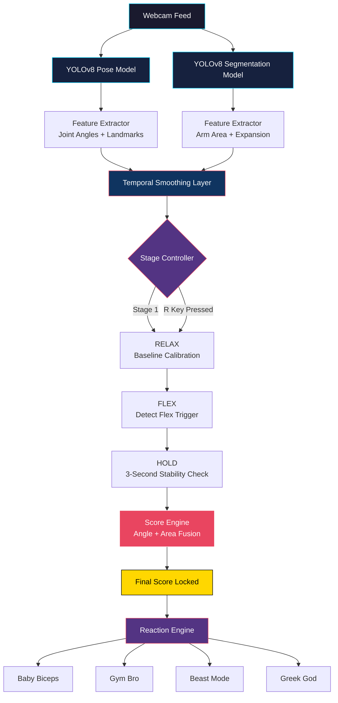
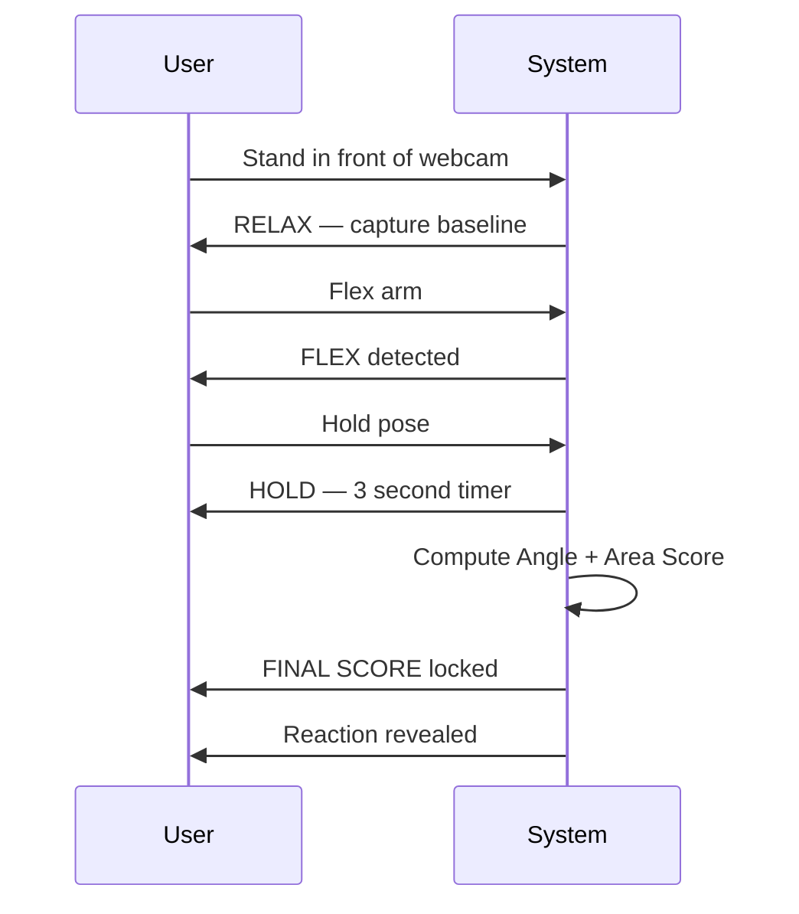

<div align="center">

# AI Hand Muscle Evaluator

### Real-Time Computer Vision Arm Flex Analyzer

*Pose detection meets pixel-perfect muscle science (sort of).*

[](https://www.python.org/)
[](https://opencv.org/)
[](https://github.com/ultralytics/ultralytics)
[](https://pytorch.org/)
[](#license)

</div>

---

## Overview

**AI Hand Muscle Evaluator** is a webcam-based computer vision application that analyzes your arm flex in real time. It combines **pose estimation**, **segmentation**, **angle geometry**, and **temporal smoothing** to score your flex — then reacts with a suitably dramatic verdict.

> It's not a medical device. It's a hype machine with math behind it.

---

## Features

| Category | Capability |
|---|---|
| Detection | Real-time webcam pose & segmentation detection |
| Automation | Automatic left/right arm selection |
| Calibration | Relax-stage baseline capture |
| Flex Engine | Flex detection with 3-second hold mechanism |
| Scoring | Stable score locking after hold completes |
| Geometry | Angle-based joint analysis |
| Vision Metrics | Arm area expansion analysis via segmentation |
| Fun Factor | Emoji reactions based on final score |
| Control | Instant reset support |

---

## System Architecture



---

## Project Structure

```text
Hand_Muscle_Evaluator/
│
├── download_models.py      # Fetches YOLOv8 Pose, Segmentation & MobileNetV2
├── flex_evaluator.py        # Main application entry point
├── feature_extractor.py     # Angle & area feature computation
├── reaction_engine.py       # Score → emoji reaction mapping
├── requirements.txt          # Python dependencies
│
├── models/                   # Downloaded model weights
├── history/                  # Session history logs
├── assets/                   # Static assets (images, icons)
│
└── README.md
```

---

## Installation

**1. Clone the repository**
```bash
git clone https://github.com/Manas-Dikshit/Hand_Muscle_Evaluator
cd Hand_Muscle_Evaluator
```

**2. Create a virtual environment**
```bash
python -m venv venv
```

**3. Activate it**

| OS | Command |
|---|---|
| Windows | `venv\Scripts\activate` |
| Linux / Mac | `source venv/bin/activate` |

**4. Install dependencies**
```bash
pip install -r requirements.txt
```

---

## Download Models

```bash
python download_models.py
```

This fetches:
- **YOLOv8 Pose** — skeletal keypoint detection
- **YOLOv8 Segmentation** — precise arm masking
- **MobileNetV2** — lightweight auxiliary feature extraction

---

## Run the App

```bash
python flex_evaluator.py
```

---

## Workflow



**Stages:**

1. **RELAX** — Keep your arm relaxed while the system captures baseline measurements.
2. **FLEX** — Flex your arm and hold the position.
3. **HOLD** — Maintain the pose for **3 seconds** straight.
4. **FINAL SCORE** — The score locks in.
5. **REACTION** — Baby Biceps · Gym Bro · Beast Mode · Greek God

---

## Controls

| Key | Action |
|---|---|
| `ESC` | Exit the application |
| `R` | Reset the current evaluation |

---

## Tech Stack

<div align="center">

| Technology | Purpose |
|---|---|
| **Python** | Core language |
| **OpenCV** | Real-time video processing |
| **Ultralytics YOLOv8** | Pose + Segmentation inference |
| **NumPy** | Numerical & geometric computation |
| **Transformers** | Auxiliary feature modeling |
| **PyTorch** | Deep learning backend |

</div>

---

## Example Output

```text
Stage: FLEX
Selected Arm: RIGHT
Angle: 73°
Score: 84
Beast Mode
```

---

## Future Improvements

- Voice reactions
- History tracking
- Progress dashboard
- Leaderboard
- Streamlit interface
- Mobile app support
- Multi-person evaluation
- Muscle growth tracking over time

---

## Disclaimer

This project evaluates **flex posture and visual appearance** from a webcam feed only.
It is **not** a medical, physiological, or strength assessment tool. Results are for entertainment purposes.

---

## License

Released under the **MIT License**.

---

<div align="center">

### Made by **MRD** with ❤️

</div>
