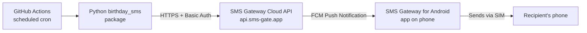

# Birthday SMS Automation

Automatically sends a Birthday SMS to people on a contact list — from
**your own Android phone and SIM card** — every year, with no PC left
running, no cloud SMS provider, and no business API.



New here? Start with [`docs/PROJECT_OVERVIEW.md`](docs/PROJECT_OVERVIEW.md)
for a plain-English explanation of what this is and why, or jump
straight to [`docs/SETUP_GUIDE.md`](docs/SETUP_GUIDE.md) for a
step-by-step walkthrough from zero to a fully running system.

Full architecture, diagrams, and design rationale: [`docs/ARCHITECTURE.md`](docs/ARCHITECTURE.md).

## Table of Contents

- [Why this project exists](#why-this-project-exists)
- [Features](#features)
- [Requirements](#requirements)
- [Quick Start](#quick-start)
- [How a Daily Run Works](#how-a-daily-run-works)
- [CSV Format](#csv-format)
- [Message Templates](#message-templates)
- [Configuration Reference](#configuration-reference)
- [Folder Structure](#folder-structure)
- [Example API Request](#example-api-request)
- [Testing](#testing)
- [Documentation Index](#documentation-index)
- [Contributing](#contributing)
- [License](#license)

## Why This Project Exists

Bulk SMS APIs (Twilio, MSG91, TextLocal, etc.) charge per message,
require sender-ID registration, and send from a number the recipient
doesn't recognize. This project instead automates the exact thing a
teacher would otherwise do by hand: text a student "Happy Birthday"
from their own phone — just automatically, every day, forever, without
anyone needing to remember to do it.

## Features

- ✅ Sends real SMS from the teacher's own SIM (no bulk SMS API)
- ✅ Fully automated via GitHub Actions — no server or PC required
- ✅ CSV-driven contact list, editable directly on GitHub
- ✅ Placeholder-based message templates (`{NAME}`, `{FIRST_NAME}`, `{AGE}`, ...)
- ✅ Per-contact custom message override
- ✅ Duplicate-send protection (won't text the same person twice in a day)
- ✅ Automatic retry with exponential backoff for transient network errors
- ✅ Delivery confirmation — polls the gateway after sending and re-checks
  unconfirmed messages (e.g. recipient's phone was off) on the next run
- ✅ Run report on the GitHub Actions **Summary** page (status counts,
  per-contact delivery outcome, unconfirmed backlog)
- ✅ Structured logging visible directly in the GitHub Actions log viewer
- ✅ `dry_run` mode to test message rendering without sending real SMS
- ✅ Type-hinted, tested, linted Python 3.12+ codebase

## Requirements

- A GitHub repository (private recommended if the CSV holds real data)
- An Android phone with a SIM plan capable of sending SMS
- [SMS Gateway for Android](https://sms-gate.app) ([GitHub](https://github.com/capcom6/android-sms-gateway), [Download APK](https://github.com/capcom6/android-sms-gateway/releases/latest/download/app-release.apk)) (capcom6, open source) installed on that phone, in **Cloud Mode**
- Python 3.12+ (only needed for local testing — GitHub Actions installs it automatically for scheduled runs)

## Quick Start

```bash
# 1. Clone
git clone https://github.com/<your-username>/birthday-sms-automation.git
cd birthday-sms-automation

# 2. (Optional) local dependency install for testing
python3 -m venv .venv && source .venv/bin/activate
pip install -r requirements-dev.txt
pip install -e .

# 3. Configure local env for testing (never commit this file)
cp .env.example .env
```

Then:
1. Set up the Android app: [`docs/SMS_GATEWAY_SETUP.md`](docs/SMS_GATEWAY_SETUP.md)
2. Add GitHub Secrets: [`docs/SECURITY.md`](docs/SECURITY.md)
3. Edit `data/birthdays.csv` with your contacts
4. Push to GitHub — the `daily.yml` workflow takes it from there

Full walkthrough: [`docs/DEPLOYMENT.md`](docs/DEPLOYMENT.md).

## How a Daily Run Works

1. **GitHub Actions triggers** `.github/workflows/daily.yml` on a
   cron schedule, timed to fire shortly after midnight in
   `BIRTHDAY_TIMEZONE` (default `Asia/Kolkata`). GitHub's own cron
   has no timing guarantee (see [Limitations](docs/ARCHITECTURE.md#13-limitations)),
   so an external scheduler ([cron-job.org](https://cron-job.org),
   optional but recommended) can call the same workflow via
   `workflow_dispatch` on time instead — full setup guide in
   [`docs/CRON_JOB_ORG_SETUP.md`](docs/CRON_JOB_ORG_SETUP.md).
2. The Python script resolves **today's date** in that timezone and
   loads every contact from `data/birthdays.csv`.
3. For each contact: skipped if disabled (`Enabled=FALSE`), skipped
   if their birthday (month + day only — year is irrelevant) isn't
   today, skipped if they were already sent a message this year
   (tracked in `data/.sent_state.json`).
4. Anyone left gets their message rendered from a template (their
   own `MessageTemplate` override, or the shared default) and sent
   through the SMS Gateway Cloud API, with automatic retry/backoff on
   transient network errors.
5. After sending, the script **polls the gateway for delivery states**
   (`GET /messages/{id}`) for up to `DELIVERY_POLL_WINDOW_SECONDS`
   (default 10 minutes). Messages confirmed `Delivered` or `Failed`
   are reported; anything still pending (typically a switched-off
   phone) is recorded as *unconfirmed* and automatically re-checked
   at the start of the next run.
6. A Markdown **run summary** (status counts, per-contact delivery
   outcome, unconfirmed backlog) is written to the workflow run's
   Summary page.
7. The updated "already sent" state is written back **atomically**
   (temp file + rename, so a crash mid-write can never corrupt it)
   and committed back to the repository by the workflow.
8. Individual send failures are logged but don't fail the whole run
   — one bad contact never blocks everyone else's birthday message.

You can also trigger a run manually anytime via the **Actions** tab
→ **Daily Birthday SMS** → **Run workflow**, with an option to
`dry_run` (render and log messages without sending anything real).

## CSV Format

File: `data/birthdays.csv`. Header row required. Only **birthdays**
are tracked — there is intentionally no anniversary/wedding-day field.

| Column | Required | Description |
|---|---|---|
| `Name` | ✅ | Full name |
| `PhoneNumber` | ✅ | E.164 format, e.g. `+919876543210` |
| `Birthday` | ✅ | `YYYY-MM-DD` preferred (also accepts `DD-MM-YYYY`, `DD/MM/YYYY`, `MM/DD/YYYY`) |
| `Classification` | – | Free text, e.g. `Student`, `Colleague`, `Class 10 - Section B` |
| `Brief` | – | Short note, e.g. section/department |
| `Address` | – | Free text |
| `Enabled` | – | `TRUE`/`FALSE` — set `FALSE` to pause messages to this contact without deleting the row. Blank = enabled |
| `LastSent` | – | Informational only; actual dedupe state lives in `data/.sent_state.json` |
| `MessageTemplate` | – | Per-contact override of the default message template |

Example:

```csv
Name,PhoneNumber,Birthday,Classification,Brief,Address,Enabled,LastSent,MessageTemplate
Rahul Sharma,+919876543210,1999-05-16,Student,Class 10 - Section B,"12 MG Road, Kolkata",TRUE,,
```

## Message Templates

Supported placeholders, substituted safely (unknown placeholders are
left untouched rather than crashing the run):

| Placeholder | Renders as |
|---|---|
| `{NAME}` | Full name |
| `{FIRST_NAME}` | First word of the name |
| `{TODAY}` | Today's date, `YYYY-MM-DD` |
| `{YEAR}` | Current year |
| `{AGE}` | Age the contact is turning today |
| `{CLASSIFICATION}` | The `Classification` column |
| `{BRIEF}` | The `Brief` column |

Default template (overridable via `DEFAULT_MESSAGE_TEMPLATE` env var
or the `daily.yml` workflow env block):

```
    "Happy Birthday to Rtn. {NAME}! 🎉🎂\n\n"
    "The members of Rotary Club, Burla extend our heartfelt wishes to you on your special day.\n\n"
    "Wishing you many, many happy returns of the day! May you be blessed with good health, happiness, success, "
    "and many more years of dedicated service to humanity through Rotary.\n\n"
    "With regards,\n"
    "Dr. Rasmikanta Pati, Asst. Professor, Mathematics\n"
    "SUIIT, Sambalpur University\n"
    "Sambalpur, Odisha-768019"
```

## Configuration Reference

All configuration is via environment variables — see
[`.env.example`](.env.example) for the full list with defaults. Key
ones:

| Variable | Required | Default | Notes |
|---|---|---|---|
| `SMS_GATEWAY_USERNAME` | ✅ | — | GitHub Secret |
| `SMS_GATEWAY_PASSWORD` | ✅ | — | GitHub Secret |
| `SMS_GATEWAY_BASE_URL` | – | `https://api.sms-gate.app/3rdparty/v1` | Only change for self-hosted relays |
| `BIRTHDAY_CSV_PATH` | – | `data/birthdays.csv` | |
| `BIRTHDAY_TIMEZONE` | – | `Asia/Kolkata` | IANA timezone name |
| `SMS_GATEWAY_MAX_RETRIES` | – | `4` | Exponential backoff |
| `SMS_GATEWAY_TIMEOUT_SECONDS` | – | `15` | Per-request timeout |
| `DRY_RUN` | – | `false` | Render but don't send |
| `DELIVERY_POLL_ENABLED` | – | `true` | Poll delivery states after sending |
| `DELIVERY_POLL_INTERVAL_SECONDS` | – | `30` | Seconds between state polls |
| `DELIVERY_POLL_WINDOW_SECONDS` | – | `600` | Max polling time per run |
| `LOG_LEVEL` | – | `INFO` | `DEBUG`/`INFO`/`WARNING`/`ERROR` |

## Folder Structure

See the full annotated tree in [`docs/ARCHITECTURE.md`](docs/ARCHITECTURE.md#8-folder-structure).

```
birthday-sms-automation/
├── .github/workflows/   # daily.yml (scheduler), keepalive.yml (anti-60-day-disable), lint.yml (CI)
├── data/                # birthdays.csv + auto-managed sent-state
├── docs/                # architecture, security, setup, deployment, FAQ
├── src/birthday_sms/    # application source
├── tests/                # pytest suite
└── README.md
```

## Example API Request

What this project sends to the SMS Gateway Cloud API under the hood
(see `sms_gateway_client.py`):

```bash
curl -u "$SMS_GATEWAY_USERNAME:$SMS_GATEWAY_PASSWORD" \
  -X POST "https://api.sms-gate.app/3rdparty/v1/messages" \
  -H "Content-Type: application/json" \
  -d '{
        "message": "Dear Rahul, wishing you a very Happy Birthday! ...",
        "phoneNumbers": ["+919876543210"]
      }'
```

## Testing

```bash
export SMS_GATEWAY_USERNAME=test
export SMS_GATEWAY_PASSWORD=test
pytest --cov=birthday_sms --cov-report=term-missing
```

Tests cover CSV parsing/validation, date parsing, message rendering,
retry/backoff behavior against a mocked HTTP layer (no real network
calls), and the full send orchestration logic.

Changes to any `.github/workflows/*.yml` file must also pass
`actionlint` (CI-enforced) — see
[`CONTRIBUTING.md`](docs/CONTRIBUTING.md#editing-github-actions-workflow-files).

### Manual Instant Test (real SMS, right now)

`python -m birthday_sms.main` checks *today's* date, so a normal run
already sends immediately if a matching birthday exists — but it
requires an actual matching row in `data/birthdays.csv`. To test
against your own number without waiting for your workflow's schedule,
call `BirthdaySender.run()` directly with today's date:

```bash
export SMS_GATEWAY_USERNAME=your_real_username
export SMS_GATEWAY_PASSWORD=your_real_password
export DRY_RUN=false

python -c "
from datetime import date
from birthday_sms.config import AppConfig
from birthday_sms.csv_reader import CsvContactRepository
from birthday_sms.sms_gateway_client import SmsGatewayClient
from birthday_sms.message_builder import MessageBuilder
from birthday_sms.state_store import SentStateStore
from birthday_sms.birthday_sender import BirthdaySender
from birthday_sms.logger import configure_logging

config = AppConfig.from_env()
configure_logging(level=config.log_level)
repo = CsvContactRepository(config.csv_path)
gw = SmsGatewayClient(config.gateway)
mb = MessageBuilder()
state = SentStateStore(config.state_file_path)
sender = BirthdaySender(config=config, repository=repo, gateway_client=gw, message_builder=mb, state_store=state)
results = sender.run(date.today())
for r in results:
    print(r.status, r.contact.phone_number, getattr(r, 'error', None))
"
```

Steps:
1. Temporarily set a contact's `Birthday` in `data/birthdays.csv` to
   today's date (use your own number, not a real student's).
2. If that number is already marked sent this year in
   `data/.sent_state.json`, remove its entry (or reset the file to
   `{}`) so the dedupe check doesn't skip it.
3. Run the snippet above. Check `SendStatus.SENT` in the output and
   your phone for the SMS.
4. Revert `data/birthdays.csv` (and `.sent_state.json` if you cleared
   it) back to their original contents afterward.

For a dry-run instead of a real send, set `DRY_RUN=true` and skip step
2 — the message is only rendered and logged, nothing is sent.

### Even Quicker: Raw curl Test

Bypasses the whole script — hits the SMS Gateway Cloud API directly.
Good for confirming your gateway credentials/app setup work at all,
independent of this project's code:

```bash
curl -u "your_real_username:your_real_password" \
  -X POST "https://api.sms-gate.app/3rdparty/v1/messages" \
  -H "Content-Type: application/json" \
  -d '{
        "message": "Test message from curl",
        "phoneNumbers": ["+91XXXXXXXXXX"]
      }'
```

Replace username, password, and phone number. A successful response
returns JSON with an `id` and `state` (e.g. `"Pending"`) — check your
phone for the SMS.

## Troubleshooting & FAQ

- Common errors and fixes: [`docs/TROUBLESHOOTING.md`](docs/TROUBLESHOOTING.md)
- Frequently asked questions: [`docs/FAQ.md`](docs/FAQ.md)
- Updating credentials, migrating phones: [`docs/SMS_GATEWAY_SETUP.md`](docs/SMS_GATEWAY_SETUP.md)

## Documentation Index

| Document | Contents |
|---|---|
| [`docs/PROJECT_OVERVIEW.md`](docs/PROJECT_OVERVIEW.md) | Plain-English what/why/how for anyone new to the project |
| [`docs/SETUP_GUIDE.md`](docs/SETUP_GUIDE.md) | Step-by-step, zero-to-running setup for a first-time user |
| [`docs/ARCHITECTURE.md`](docs/ARCHITECTURE.md) | System design, diagrams, tech stack, failure scenarios, versioning |
| [`docs/SECURITY.md`](docs/SECURITY.md) | Threat model, secrets handling, credential rotation/revocation |
| [`docs/SMS_GATEWAY_SETUP.md`](docs/SMS_GATEWAY_SETUP.md) | Android app installation, permissions, Cloud Mode setup |
| [`docs/DEPLOYMENT.md`](docs/DEPLOYMENT.md) | Step-by-step from clone to fully running system |
| [`docs/CRON_JOB_ORG_SETUP.md`](docs/CRON_JOB_ORG_SETUP.md) | External scheduler setup - token creation, job config, curl self-tests, troubleshooting |
| [`docs/TROUBLESHOOTING.md`](docs/TROUBLESHOOTING.md) | Symptom → cause → fix reference |
| [`docs/FAQ.md`](docs/FAQ.md) | Common questions |
| [`docs/CONTRIBUTING.md`](docs/CONTRIBUTING.md) | Dev setup, style, PR process |

## Contributing

See [`docs/CONTRIBUTING.md`](docs/CONTRIBUTING.md).

## License

[MIT](LICENSE) — "SMS Gateway for Android" is a trademark/product of
[capcom6](https://github.com/capcom6); this project is an independent
integration and is not affiliated with or endorsed by it.
