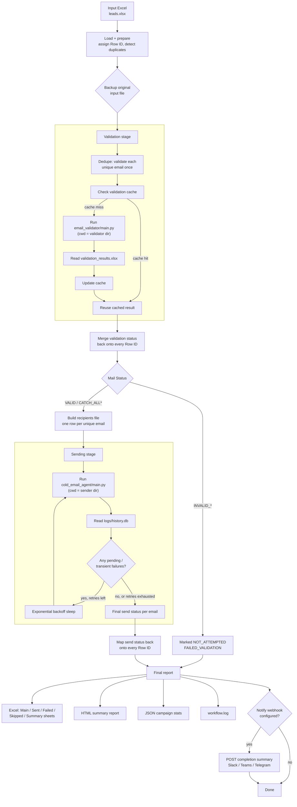

# Merged Cold Outreach Pipeline

This directory contains three things:

```
root/
├── email_validator/       <- your existing validator, untouched
├── cold_email_agent/      <- your existing sender, untouched
├── merge_pipeline.py      <- orchestrator that chains the two together
└── README.md              <- this file
```

`merge_pipeline.py` does not modify either project. It shells out to each
one's `main.py` exactly the way you already run it manually, and adds the
bookkeeping needed to treat "validate then send" as a single campaign:
Row IDs, duplicate handling, retries, logging, and one final report.

---

## 1. Architecture


`*` only if `--allow-catchall` is passed.

---

## 2. Design decisions worth knowing

- **Row ID is the join key, not email.** Every row gets `ROW-000001`,
  `ROW-000002`, ... the moment the input is read. Every internal merge uses
  it. The one exception is reading `logs/history.db` from the sender — that's
  an external black box keyed on email, so that one lookup matches on email
  and is immediately folded back onto Row ID.
- **Original row order is preserved** end to end via an internal
  `_orig_order` column; the final report is always re-sorted to match your
  input file's order.
- **Duplicate emails** are detected before validation. By default only the
  first occurrence of a given email is validated (result is reused for the
  rest) and only one row per unique email is ever handed to the sender —
  every duplicate is marked `SKIPPED_DUPLICATE` and never sent.
- **Retries lean on the sender's own resume behavior.** Your sender already
  skips addresses it has successfully emailed and resumes safely if
  interrupted, so instead of re-implementing retry logic, this script
  re-invokes the *same* sender command against the *same* recipients file
  after an exponential backoff, until nothing is left pending or the retry
  budget runs out. This is also what `--resume` uses.
- **Every path is resolved to absolute and validated before anything runs.**
  `validate_environment()` checks the input file, both project directories,
  both `main.py` entrypoints, and the template all exist — and logs the
  exact absolute paths it resolved — before the first subprocess is
  launched. If something's wrong, you get one clear error up front instead
  of a `sqlite3.OperationalError` three stages in.
- **Each subprocess runs with `cwd` set to its own project directory** (the
  validator runs with `cwd=validator_dir`, the sender with `cwd=sender_dir`),
  matching how you run them manually (`cd cold_email_agent && python
  main.py ...`). `main.py` itself is passed as an absolute path so it is
  never re-joined against `cwd` by accident.

---

## 3. Output layout

```
<output-dir>/<campaign_id>/
├── backups/        input excel, backed up before anything runs
├── intermediate/   validator_input.xlsx, validated_recipients.xlsx,
│                   filtered_recipients.xlsx, send_results.xlsx,
│                   validation_cache.json
├── logs/           workflow.log (timestamped, level-configurable)
└── reports/
    ├── final_report_<name>.xlsx   (Main / Sent / Failed / Skipped / Summary)
    ├── final_report_<name>.html
    └── campaign_stats_<campaign_id>.json
```

---

## 4. Usage

### macOS / Linux (bash)
```bash
python3 merge_pipeline.py \
    --input data/leads.xlsx \
    --validator-dir ./email_validator \
    --sender-dir ./cold_email_agent \
    --template ./cold_email_agent/data/template.txt \
    --campaign-name "Startup Outreach - June" \
    --workers 20 \
    --max-send-retries 3 \
    --dry-run
```

### Windows (PowerShell)
PowerShell's line-continuation character is a **backtick** ( `` ` `` ), not a
backslash. Using `\` (the bash/Linux style) is what causes the "everything
on one line" / path-mangling errors:

```powershell
python Merge_code.py `
    --input "Email_Validator-/input/Raw_Email.xlsx" `
    --validator-dir "Email_Validator-" `
    --sender-dir "cold_email_agent" `
    --template "cold_email_agent/data/template.txt" `
    --campaign-name "Startup Outreach - June" `
    --workers 20
    --dry-run
```

Or just put it all on one line — that always works, on any shell:

```powershell
python merge_pipeline.py --input data\leads.xlsx --validator-dir .\email_validator --sender-dir .\cold_email_agent --template .\cold_email_agent\data\template.txt --campaign-name "Startup Outreach - June" --dry-run
```

Drop `--dry-run` once you've checked `intermediate/filtered_recipients.xlsx`
and are happy with who's about to get emailed.

### Resuming an interrupted campaign
```bash
python merge_pipeline.py --resume --campaign-id CAMPAIGN-20260704-101500 \
    --input data/leads.xlsx --validator-dir ./email_validator \
    --sender-dir ./cold_email_agent --template ./cold_email_agent/data/template.txt \
    --campaign-name "Startup Outreach - June"
```

---

## 5. Things that depend on your actual codebases

These are auto-detected with sensible fallbacks, but worth checking once
against your real files (search `merge_pipeline.py` for `ADJUST ME`):

1. **`logs/history.db` schema** — column names for status, SMTP code/response,
   exception, message ID, sender email. The script prints what it
   auto-detects on first run; override with `--db-status-col`,
   `--db-smtp-code-col`, etc. if it guesses wrong.
2. **Input sheet column names** for Brand Name / Contact Name / Category /
   Website / City / Notes, mapped in `build_recipients()`.

---

## 6. Troubleshooting the exact issue you hit

If you ever see a subprocess fail with a path-looking error again, check
`logs/workflow.log` for the `Resolved paths for this run:` block that's
printed at the very start of every campaign — it shows the exact absolute
`validator_dir`, `sender_dir`, `template`, and `input_excel` the script is
using, before anything is executed. If one of those doesn't match what you
expect, that's the fix, not the subprocess code.